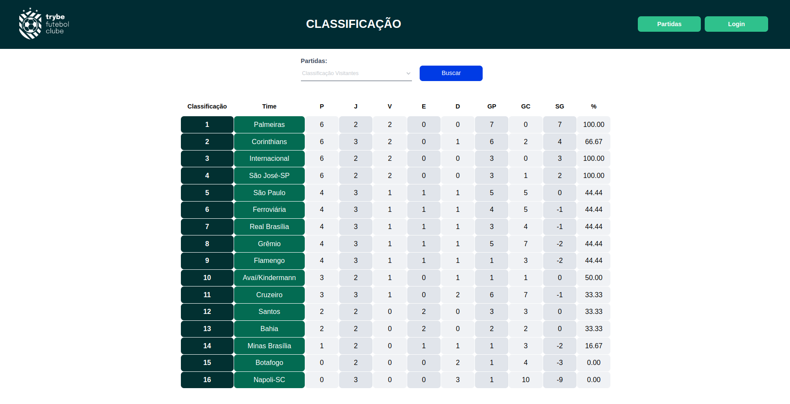

# Trybe Futebol Clube

# Sobre o projeto

Neste projeto, uma aplicação front-end foi fornecida pela _[Trybe](https://www.betrybe.com)_, o projeto portanto consiste de uma API a qual fornece os dados necessários para estar populando um site que exibe classificações de partidas de futebol.

## Layout web



# Tecnologias utilizadas
## Back end
- Node.js
- Express
- Typescript
- MySQL
- Sequelize
- Docker
- JWT

# Como executar o projeto

## Back end
Pré-requisitos: npm / docker

```bash
# clonar repositório
git clone git@github.com:nathankimura/trybe-futebol-clube.git

# entrar na pasta do projeto back end
cd trybe-futebol-clube

# executar o projeto
npm run compose:up
npm run compose:down // para parar a aplicação
```
Após executar os comandos acima, o front do projeto fica disponível para visualização no endereço http://localhost:3000 da sua máquina local.

### Endpoints

#### Login

| Método HTTP | Ação | URL/endpoint |
|---|---|---|
| `POST` | Requisição para login de usuário | http://localhost:3001/login |
| `GET` | Valida se o usuário é o administrador | http://localhost:3001/login/validate |

No body da requisição POST é necessário informar o seguinte JSON contendo email e senha:

```
{
  "email": "Nome do Usuário",
  "password": "senha_secreta"
}
```


#### Times

| Método HTTP | Ação | URL/endpoint |
|---|---|---|
| `GET` | Retorna todos os times presentes no banco de dados | http://localhost:3001/teams |
| `GET` | Retorna um time específico buscando pelo id | http://localhost:3001/teams/:id |


#### Partidas

| Método HTTP | Ação | URL/endpoint |
|---|---|---|
| `GET` | Retorna todos as partidas presentes no banco de dados  | http://localhost:3001/matches |
| `GET` | Retorna todos as partidas em progresso presentes no banco de dados | http://localhost:3001/matches?inProgress=true |
| `GET` | Retorna todos as partidas finalizadas presentes no banco de dados | http://localhost:3001/matches?inProgress=false |
| `POST` | Criação de uma nova partida | http://localhost:3001/matches |
| `PATCH` | Atualiza a chave 'inProgress' para finalidado de uma partida específica | http://localhost:3001/matches/:id/finish |
| `PATCH` | Atualiza os gols de uma partida específica | http://localhost:3001/matches/:id |

No body da requisição POST é necessário informar o seguinte JSON:

```
{
  "homeTeam": 16, // O valor deve ser o id do time
  "awayTeam": 8, // O valor deve ser o id do time
  "homeTeamGoals": 2,
  "awayTeamGoals": 2,
  "inProgress": true
}
```

No body da requisição PATCH para atualizar os gols realizados é necessário informar o seguinte JSON:

```
{
  "homeTeamGoals": 3,
  "awayTeamGoals": 1
}
```

#### Placar

| Método HTTP | Ação | URL/endpoint |
|---|---|---|
| `GET` | Retorna a classificação geral dos times | http://localhost:3001/leaderboard |
| `GET` | Retorna a classificação dos times mandantes | http://localhost:3001/leaderboard/home |
| `GET` | Retorna a classificação dos times visitantes | http://localhost:3001/leaderboard/away |

# Autor

Nathan Kimura Maciel

https://www.linkedin.com/in/nathan-kimura-03274b240/
